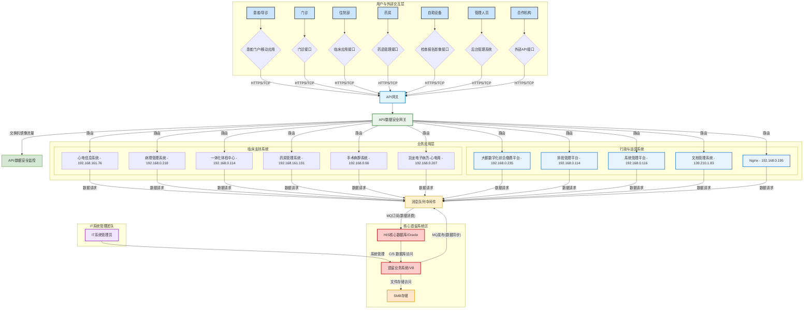

# HIS医院信息系统架构图

## 系统概述

本架构图展示了HIS（Hospital Information System）医院信息系统的整体架构设计，采用分层架构模式，从上到下包含用户交互层、API层、业务应用层、中间件层、核心遗留系统区和IT管理团队。

## 架构层次说明

### 1. 用户与外部交互层
- **患者/导诊** → 患者门户/移动应用
- **门诊** → 门诊接口  
- **住院部** → 临床应用接口
- **药房** → 药品管理接口
- **自助设备** → 检查报告影像接口
- **管理人员** → 后台管理系统
- **合作机构** → 外部API接口

### 2. API层
- API网关：统一入口，负责请求路由和负载均衡

### 3. API/数据安全层
- API/数据安全网关：安全认证和授权
- API/数据安全监控：实时监控和安全审计

### 4. 业务应用层
- **临床支持系统**：心电信息系统、病理管理系统、一体化体检中心、药房管理系统、手术麻醉系统、电子病历系统
- **行政与运营系统**：缴费平台、排班管理、系统管理、文档管理、Nginx

### 5. 中间件层
- 消息队列中间件：负责系统间数据同步和异步处理

### 6. 核心遗留系统区
- HIS核心数据库/Oracle：核心数据存储
- 遗留业务系统/VB：传统业务逻辑
- SMB存储：文件存储服务

### 7. IT系统管理团队
- IT系统管理员：系统运维和管理

## 系统架构图

## 技术特点

- **分层架构**：采用清晰的分层设计，便于维护和扩展
- **微服务化**：业务应用模块化，支持独立部署和扩展
- **安全防护**：多层安全防护，包括API网关、数据安全监控
- **数据同步**：通过消息队列实现系统间数据同步
- **遗留系统集成**：有效整合传统VB系统和现代微服务架构

## 部署说明

- 各业务系统部署在独立的服务器上，通过IP地址标识
- 核心数据库使用Oracle，确保数据一致性和可靠性
- 文件存储采用SMB协议，支持大容量文件管理
- IT管理团队负责系统运维、监控和维护

