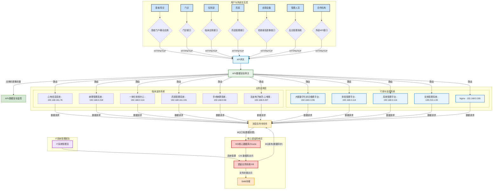

# 医院混合IT架构下的数据安全管理框架与战略路线图

## 摘要

本报告深入分析了医院混合IT架构下的数据安全挑战，构建了全面的数据安全管理框架，并提供了分阶段的实施路线图。报告基于对医院现有IT生态系统的详细分析，识别出关键风险点，并提出了符合国家法规要求的综合性安全解决方案。

## 目录

- [第一部分：医院混合IT生态系统分析](#第一部分医院混合it生态系统分析)
  - [1.1 IT架构拓扑：业务与数据关系](#11-it架构拓扑业务与数据关系)
  - [1.2 演进轨迹：从单体核心到混合服务架构](#12-演进轨迹从单体核心到混合服务架构)
  - [1.3 业务能力与应用架构映射](#13-业务能力与应用架构映射)
- [第二部分：医疗健康数据资产综合分析](#第二部分医疗健康数据资产综合分析)
  - [2.1 关键数据域的识别与分类](#21-关键数据域的识别与分类)
  - [2.2 依据国家标准的数据分类与敏感度映射](#22-依据国家标准的数据分类与敏感度映射)
  - [2.3 数据流分析与高风险节点识别](#23-数据流分析与高风险节点识别)
- [第三部分：医疗机构面临的现代威胁图景](#第三部分医疗机构面临的现代威胁图景)
  - [3.1 主要外部攻击向量与攻击者策略](#31-主要外部攻击向量与攻击者策略)
  - [3.2 内部风险与供应链威胁](#32-内部风险与供应链威胁)
- [第四部分：战略性数据安全管理框架](#第四部分战略性数据安全管理框架)
  - [4.1 基础支柱：治理、风险与合规 (GRC)](#41-基础支柱治理风险与合规-grc)
  - [4.2 技术支柱：深度防御架构控制](#42-技术支柱深度防御架构控制)
  - [4.3 运营支柱：主动安全运营与人为因素](#43-运营支柱主动安全运营与人为因素)
- [第五部分：构建以数据为中心的主动安全防御路线图](#第五部分构建以数据为中心的主动安全防御路线图)
  - [5.1 奠定基石：全面的数据资产梳理与分级](#51-奠定基石全面的数据资产梳理与分级)
  - [5.2 核心能力：监控流动中的数据](#52-核心能力监控流动中的数据)
  - [5.3 运营闭环：可持续的告警与响应](#53-运营闭环可持续的告警与响应)
  - [5.4 实施路线图与衡量指标](#54-实施路线图与衡量指标)
  - [5.5 关键绩效指标 (KPI)](#55-关键绩效指标-kpi)
- [参考文献](#参考文献)

## 第一部分：医院混合IT生态系统分析

本部分旨在对医院当前的技术状态进行基础性分析，将目前系统收集的数据进行了初步的分析，梳理应用，API接口，数据流向，业务交互。并根据IT演进情况，给出数据安全知道，并深入剖析其对业务运营的深远影响。

### 1.1 IT架构拓扑：业务与数据关系

为了清晰地描绘当前医院信息技术（IT）系统的复杂性与相互关系，我们首先构建一个全面的架构拓扑图。该图整合了手绘流程图（图1）与详细的应用系统列表（图2）中的信息，旨在成为贯穿本报告的核心参考模型。

#### 图表组件解析

- **核心遗留系统区 (Core Legacy System Zone)**: 此区域清晰地界定了作为业务记录核心的HIS系统（VB客户端）及其后端的Oracle数据库。这是医院最早期、最核心的交易处理系统，承载着最关键的患者数据。

- **中间件与集成层 (Middleware & Integration Layer)**: 突出显示了IP地址为192.168.0.93的消息队列（MQ）代理。它扮演着连接新旧世界的关键枢纽角色，负责将遗留系统的数据变更异步同步到现代服务中。

- **现代服务与API层 (Modern Services & API Layer)**: 汇集了所有新建的、以API为驱动的业务系统。这些系统根据其功能被逻辑划分为临床支持、行政运营和平台基础服务等集群，共同构成医院现代化的业务能力。

- **基础设施与网络层 (Infrastructure & Network Layer)**: 展示了作为连接主干的网络交换机，并逻辑推断出API网关作为所有API请求的统一入口。

- **安全监控层 (Security Monitoring Layer)**: 明确了API数据安全监控平台的部署位置，它对流经API网关的流量进行深度检测，监控数据的使用情况。

- **用户与外部交互层 (User & External Interaction Layer)**: 描绘了各类系统使用者（医生、患者、管理员）以及第三方系统如何与医院的IT生态系统进行交互。

### 1.2 演进轨迹：从单体核心到混合服务架构

医院IT架构的演变并非单纯的技术升级，而是应对日益复杂的医疗健康需求所做出的战略性调整。这一演进过程反映了行业从封闭、集中的信息管理模式向开放、互联的服务模式转变的宏观趋势。
#### 遗留的单体核心（C/S结构）分析
最初的HIS系统是典型的客户端/服务器（C/S）架构，其特点是前后端紧密耦合。这种架构在早期具备明显的优势：数据集中控制，逻辑清晰，运行稳定。然而，随着时间的推移，其固有的弊端日益凸显。系统的刚性结构使得任何微小的功能变更或外部系统集成都变得异常困难和昂贵。维护成本高昂，且由于技术栈老旧（如VB桌面软件），导致其存在巨大的技术债务。更重要地，这类遗留系统往往缺乏现代安全设计理念，其操作系统、数据库版本可能早已停止官方支持，成为未修补漏洞的温床，构成了医院信息资产中最大的单一风险源 1。这些系统掌握着医院的“皇冠上的明珠”——核心患者数据，但其脆弱的防护能力使其成为勒索软件和数据窃取攻击的首要目标 1。
#### 现代化的驱动力

推动架构向API为中心模式演进的背后，是多重业务压力的综合作用。首先，临床医生对移动办公的需求日益迫切，他们需要在查房、会诊时通过移动设备即时访问患者病历和检查结果。其次，以患者为中心的服务理念要求医院提供在线预约、报告查询、费用支付等功能的患者门户或移动应用。此外，国家层面的医疗信息化政策要求医院具备与区域卫生信息平台、医保系统等进行数据交换和互操作的能力。最后，物联网医疗设备（IoMT）的普及，如智能监护仪、可穿戴设备等，也需要通过标准化的接口将数据集成到核心诊疗流程中。这些需求都无法在原有的封闭单体架构上高效实现，迫使医院必须构建一个更灵活、开放的面向服务的架构。

#### "飞行中"的混合状态风险

当前医院的IT架构正处于一个高风险的过渡阶段。消息队列（MQ）是连接过去与未来的关键"铰链"。它的稳定运行至关重要，一旦MQ代理发生故障或被攻击，将导致新旧系统之间的数据严重不同步，引发业务混乱。更危险的是，MQ本身可能成为一个攻击向量。攻击者若能控制MQ，不仅可以窃听所有同步的数据，还可能向现代业务系统注入伪造数据，或以此为跳板，反向攻击脆弱的遗留系统区。这种混合架构形成了一个复杂且碎片化的攻击面，安全防护的难度远超单一架构。

### 1.3 业务能力与应用架构映射

为了从业务风险的角度理解IT架构，必须将图2中罗列的技术资产与其所支撑的业务功能进行关联。这种映射揭示了不同系统在医院整体运营中的价值和关键性，为后续的风险评估和安全策略制定提供了业务上下文。
#### 业务领域映射

通过分析应用名称，我们可以将其归类到以下几个核心业务领域：

- **核心临床系统**: HIS（未在列表中，但为核心）、LIS系统（检验信息）、PACS平台/CT后处理系统（影像归档与通信）
- **患者管理与行政**: 大额数字化综合缴费平台、一体化体检中心、排班管理平台、药库管理系统
- **专科临床支持**: 心电信息系统、病理管理系统、手术麻醉系统
- **基础设施与平台服务**: Apache Tomcat、Nginx、CSS后台服务器，这些是支撑现代应用运行的基础环境

#### 架构碎片化与数据孤岛的潜在问题

图2中的应用列表展示了众多独立的系统，每个系统都有自己的IP地址。虽然MQ机制实现了从核心HIS到这些新系统的数据同步，但这些新系统之间的互操作模式并不明确。例如，心电信息系统是否能够直接查询病理管理系统的数据？还是所有跨系统的数据交换都必须通过中央的API网关或另一个MQ主题进行中转？

这种架构模式暗示了在"现代服务区"内部可能存在新的数据孤岛。每个系统可能在本地缓存或处理从MQ接收的数据，形成自己独立的数据库。这种碎片化不仅增加了IT管理的复杂性，使得构建患者360度视图变得困难，更创造了多个潜在的安全故障点。东西向流量（即服务与服务之间的通信）的安全性往往被忽视，而这正是高级攻击者在内网中进行横向移动的关键路径。因此，后续的安全方案既要关注遗留系统与现代系统之间的边界防护，还必须解决现代微服务集群内部的通信安全问题。

为了将技术资产与业务风险进行系统性关联，下表提供了一个详细的应用组合与业务功能映射分析。

#### 表1：应用组合、业务功能及数据敏感度映射

| 应用名称 | IP地址 | 推断的业务功能 | 主要处理的数据类型 | 交互系统 | 数据敏感度等级 (依据GB/T 39725) |
|---------|--------|----------------|-------------------|----------|--------------------------------|
| HIS系统 (核心) | - | 医院信息系统核心 | 电子病历(EHR), 个人身份信息(PII), 医嘱, 住院信息 | Oracle DB, MQ | Level 4 / Level 5 |
| Oracle数据库 | - | 核心数据存储 | EHR, PII, 财务数据, 运营数据 | HIS系统, MQ代理 | Level 4 / Level 5 |
| LIS系统 | 192.168.0.92 | 实验室检验信息管理 | 检验报告, 患者PII, 临床诊断信息 | MQ, HIS(间接), API网关 | Level 4 |
| 心电信息系统 | 192.168.161.76 | 心电图数据采集与管理 | ECG波形数据, 诊断报告, 患者PII | MQ, HIS(间接), API网关 | Level 4 |
| 病理管理系统 | 192.168.0.218 | 病理切片与报告管理 | 病理报告, 组织学图像, 患者PII | MQ, HIS(间接), API网关 | Level 4 |
| PACS平台 | 192.168.0.158 | 医学影像归档与通信 | DICOM影像, 放射学报告, 患者PII | CT/MRI设备, MQ, API网关 | Level 4 |
| 大额数字化综合缴费平台 | 192.168.0.235 | 患者费用支付与结算 | 财务信息, 支付账户, 患者PII | HIS(间接), 银行/支付接口 | Level 4 |
| 药库管理系统 | 192.168.161.131 | 药品库存与分发管理 | 药品信息, 处方数据, 库存记录 | HIS(间接), 药房系统 | Level 3 / Level 4 |
| API数据安全监控平台 | - | API流量监控与安全审计 | API请求/响应日志, 元数据 | API网关 | Level 3 (日志) |

这张表格的价值在于，它将一个纯粹的技术清单转化为了一个以业务为中心的风险视图。通过将应用、功能、数据类型和敏感度等级清晰地对应起来，医院的管理者（从IT部门到临床科室主任）都能直观地理解，当某个系统受到攻击时，究竟是哪些核心业务和敏感数据将面临风险。例如，表格清晰地显示LIS系统承载着Level 4的敏感数据，任何针对该系统的攻击都可能直接导致大量患者的检验报告和诊断信息泄露。这种明确的风险关联为后续章节中提出的、基于风险的、分层级的安全控制措施提供了坚实且合乎逻辑的依据。

## 第二部分：医疗健康数据资产综合分析

医院最有价值的资产无疑就是其数据。本部分将深入剖析这些数据资产，建立一个正式的分类体系，并分析数据在架构中的流动路径、存储位置及其最脆弱的环节。

### 2.1 关键数据域的识别与分类

基于第一部分对应用系统的分析，我们可以识别出流经整个IT架构的多种关键数据类型。对这些数据域进行明确的分类，是理解数据风险和制定保护策略的第一步。
#### 核心数据域

- **电子健康档案 (EHR/EMR)**: 这是源自核心HIS系统的数据金矿，包含了患者的人口统计学信息（姓名、身份证号、联系方式）、既往病史、过敏史、家族史、主诉、诊断记录、治疗方案等。这是最全面、最敏感的个人健康信息集合。

- **临床诊疗结果**: 这类数据由各个专科系统产生，包括：
  - 检验报告: 来自LIS系统的血液、尿液、生化等各类检验结果
  - 影像数据与报告: 来自PACS和CT/MRI等设备的DICOM格式影像文件，以及放射科医生出具的诊断报告
  - 病理报告: 来自病理管理系统的组织切片图像和病理诊断结论
  - 生理信号数据: 如心电信息系统记录的ECG波形和分析报告

- **药品与处方数据**: 包含医生开具的电子处方、药房的药品调剂记录、药库的库存信息等。这些数据不仅涉及患者治疗，也与药品供应链管理相关。

- **行政与财务数据**: 包括患者的住院/门诊记录、费用明细、医保结算信息、自费支付记录等。这类数据同时具有个人信息和财务信息的双重敏感性。

- **运营与审计数据**: 包括各应用系统的运行日志、数据库访问日志、用户登录与操作记录（如API调用日志）等。这些数据对于安全事件的追溯和系统故障排查至关重要。

### 2.2 依据国家标准的数据分类与敏感度映射

为了确保数据管理的合规性和有效性，必须采用国家权威标准对医院的数据资产进行正式的分类分级。中华人民共和国国家标准 GB/T 39725-2020《信息安全技术 健康医疗数据安全指南》提供了明确的框架。将此标准应用于医院的数据域，不仅是满足监管要求的必要步骤，也是实施差异化、基于风险的安全保护策略的科学基础。
#### 数据敏感度分级

- **第5级 (极度敏感)**: 未经授权的披露可能对数据主体造成严重损害的数据。这包括涉及特殊病种（如艾滋病、性病、精神疾病）的诊疗记录、个人基因测序数据、以及其他法律法规明确规定的高度隐私信息。这类数据应仅限于主治医护人员在严格授权和审计下访问。

- **第4级 (高度敏感)**: 未经授权的披露可能对数据主体造成较高程度损害的数据。这主要指能够直接识别个人身份，并包含其详细诊疗信息的数据集，例如一份完整的、包含姓名和身份证号的电子病历。医院大部分的核心临床数据，如EHR、检验报告、影像报告等，都属于此级别。

- **第3级 (较为敏感)**: 未经授权的披露可能对数据主体造成中等程度损害的数据。这包括经过部分去标识化处理，但仍存在被重新识别风险的数据，或一些敏感度较低的可识别健康信息。例如，仅包含门诊号和就诊科室的记录。

- **第2级 (内部数据)**: 不可直接识别个人身份的聚合统计数据。例如，用于科研或医院运营分析的、按年龄段和疾病分类的患者数量统计报告。

- **第1级 (公开数据)**: 可完全公开的数据，如医院的科室介绍、公开的联系电话等。

### 2.3 数据流分析与高风险节点识别

本节将追踪第4级和第5级敏感数据在IT架构中的完整生命周期，从创建、传输、处理到存储，旨在识别出数据泄露或篡改风险最高的关键节点。
#### 关键数据流路径分析

**患者建档与病历创建**: 数据始于HIS客户端。患者信息通过人工录入，经由内部网络传输至后端的Oracle数据库进行存储。此处的风险在于客户端本身的安全（如恶意软件）和传输过程的加密是否到位。

**核心数据同步 (高风险)**: 这是整个混合架构中最关键、最脆弱的数据流。数据变更从Oracle数据库被捕获，然后作为消息发布到MQ代理，最后被下游的多个现代业务系统订阅消费。这个流程中存在多个高风险节点：

- **数据抽取**: 从Oracle抽取数据的进程本身是否安全？它是否拥有过高的数据库权限？
- **传输到MQ**: 从数据库服务器到MQ代理的传输通道是否强制使用TLS加密？
- **MQ代理自身安全**: MQ代理是否配置了强身份认证，以防止未经授权的发布者或订阅者接入？消息在MQ中持久化存储时（at-rest）是否加密？
- **数据消费**: 订阅MQ消息的业务系统，其凭证管理是否安全？

**API数据服务**: 现代业务系统处理完数据后，通过API网关向前端应用（医生工作站、患者门户）提供服务。虽然已有API数据安全监控平台，但它主要监控的是API调用行为。风险在于API实现本身是否存在漏洞，如越权访问（一个普通用户通过操纵API参数获取了其他患者的信息）、SQL注入等。

**诊断数据集成**: 来自CT、心电图机等医疗设备的数据，首先被传输到各自的专业系统（如PACS、心电信息系统）。随后，这些系统需要将诊断结果与HIS中的患者EHR进行关联。这个过程的数据流路径可能很复杂，涉及设备专用网络、应用间接口等，每一环节都可能成为安全薄弱点。
#### "数据投毒"威胁向量的深度剖析

传统的安全思维模式主要集中在数据的机密性保护，即防止数据被窃取。然而，在当前这种依赖消息队列进行数据同步的架构中，一个更隐蔽、破坏性更强的威胁是针对数据完整性的攻击，即"数据投毒"。

**攻击逻辑**: 攻击者不以窃取数据为首要目标，而是通过某种方式（例如，攻陷了某个可以向MQ发布消息的边缘系统，或是直接利用了MQ代理的配置漏洞）向MQ中注入一条精心构造的恶意消息。这条消息可能包含伪造的患者信息，例如：

- **修改患者血型**: 将A型血患者的记录篡改为B型
- **篡改过敏史**: 删除患者对青霉素的过敏记录
- **伪造检验结果**: 将一名危重病人的关键指标修改为正常范围

由于MQ是系统中公认的"可信"数据分发渠道，所有订阅了相关主题的下游业务系统（如电子病历系统、手术麻醉系统、药房系统）会毫无戒备地接收并处理这条恶意数据，用它来更新各自的本地数据库。

**灾难性后果**: 可能直接导致严重的医疗事故：医生基于被篡改的血型信息进行输血；根据错误的过敏史开具致命的处方；因伪造的正常检验结果而延误对危重病人的抢救。

现有的API数据安全监控平台对此类攻击几乎是无能为力的。因为该平台监控的是通过API消费数据的行为，它假设了数据源头（即业务系统内的数据库）是可信的。它无法检测到数据在进入业务系统之前，在中间件层面被污染的过程。这揭示了当前安全体系中一个致命的可见性和控制盲区。防护策略必须从单纯的边界和API防护，扩展到对核心数据同步链路的完整性监控和验证。

## 第三部分：医疗机构面临的现代威胁图景

本部分将医院面临的具体风险置于更广泛的行业网络安全威胁背景下进行分析，利用详实的研究数据，描绘出一幅清晰的、针对医疗行业的网络攻击图景。

### 3.1 主要外部攻击向量与攻击者策略

综合分析显示，医疗机构正面临着来自外部的、多样化且日益复杂的网络攻击。这些攻击不仅以窃取高价值的医疗数据为目的，更频繁地通过破坏系统可用性来直接影响患者护理。
#### 主要威胁类型

- **数据泄漏与隐私泄露**: 这是医疗行业面临的最根本、最广泛的安全威胁。攻击者通过各种手段窃取患者的个人健康信息、财务数据、医疗记录等敏感数据，然后在暗网出售或用于其他非法目的。数据泄漏不仅违反法律法规，更直接损害患者隐私权，可能导致身份盗用、保险欺诈等严重后果。医院作为数据控制者，一旦发生大规模数据泄漏，将面临巨额罚款、法律诉讼和声誉损失。

- **Web应用与API攻击**: 随着医院加速数字化转型，越来越多地采用基于Web的患者门户、远程医疗平台和移动应用，针对Web应用和API的攻击也随之激增。攻击者利用常见的漏洞，如SQL注入、跨站脚本（XSS）、失效的访问控制等，绕过传统防火墙，直接窃取后端数据库中的敏感数据。医院当前向API驱动架构的演进，使其直接暴露在此类攻击的风险之下。

- **网络钓鱼与社会工程学**: 这是绝大多数网络攻击（包括勒索软件）的初始切入点。攻击者通过发送伪装成合法来源的电子邮件，诱骗医院员工点击恶意链接或下载恶意附件，从而在内网中获得最初的立足点。医疗机构人员构成复杂，工作繁忙，安全意识参差不齐，这使得他们成为社会工程学攻击的理想目标。

- **分布式拒绝服务 (DDoS) 攻击**: 此类攻击旨在通过海量的垃圾流量耗尽服务器或网络带宽资源，导致关键在线服务（如医院官网、患者门户）瘫痪。近年来，一些黑客行动主义组织（如Killnet）出于政治动机，专门针对西方国家的医院发起大规模DDoS攻击，旨在制造社会混乱，直接中断患者护理服务。

- **勒索软件 (Ransomware)**: 这是当前对医疗行业最具破坏性的威胁之一。攻击者之所以偏爱攻击医院，是因为医疗服务的连续性至关重要，任何中断都可能危及生命，这给医院管理者带来了巨大的支付赎金的压力。全球范围内的众多案例，如导致美国医疗支付系统大面积瘫痪的Change Healthcare攻击事件，以及使全美第二大非营利连锁医院集团旗下140多家医院运营中断的CommonSpirit攻击事件，都雄辩地证明了勒索软件攻击能够造成毁灭性的财务损失（平均每次攻击损失高达数百万美元）和运营灾难。

### 3.2 内部风险与供应链威胁

除了来自外部的直接攻击，源自内部和可信第三方的威胁同样不容忽视。这些威胁往往更难被发现，因为它们利用了已有的信任关系。

#### 内部人员威胁

内部威胁分为两类：一是恶意的内部人员，如心怀不满的员工利用其合法权限窃取或破坏数据；二是更为常见的疏忽大意的内部人员。例如，医生为了方便，使用弱密码或在多个系统间共用密码；IT管理员错误配置云服务，导致敏感数据暴露在公网上；员工无意中将含有病毒的U盘插入内网电脑等。医疗机构中角色众多（医生、护士、行政、科研人员），权限管理极其复杂，这极大地增加了因权限分配不当或访问行为监管不力而产生的内部风险。

#### 供应链与第三方风险

医院的IT生态系统严重依赖第三方供应商提供的软硬件产品和服务。这些供应链环节引入了多重风险。首先，采购的商业软件或开源组件本身可能含有未被发现的漏洞（如Log4j漏洞），攻击者可利用这些漏洞入侵医院系统。其次，许多大型医疗设备（如CT、MRI）的供应商需要通过远程连接来进行设备维护。这些远程访问通道如果管理不善，就可能成为攻击者从外部直接进入医院核心网络的"后门"。

#### 物联网医疗设备 (IoMT) 风险

现代医院网络中连接着大量的医疗设备，如输液泵、监护仪、便携式超声设备等。这些IoMT设备在设计时往往优先考虑功能性而非安全性，普遍存在使用默认弱密码、运行过时且无法修补的操作系统、缺乏加密通信等问题。攻击者可以轻易地控制这些防护薄弱的设备，将它们作为跳板，对医院内网的其他高价值目标发起攻击。
为了系统性地评估当前架构中的风险，下表构建了一个架构风险评估矩阵，将关键组件、潜在漏洞、相关威胁和业务影响进行了关联分析。

#### 表2：架构风险评估矩阵

| 架构组件 | 关键漏洞 | 相关威胁 | 影响 (C/I/A) | 可能性 | 综合风险评分 (高/中/低) |
|---------|----------|----------|---------------|--------|------------------------|
| Oracle数据库 | 操作系统/数据库版本老旧，未及时打补丁；弱口令或默认口令 | 勒索软件加密；数据大规模泄露；数据篡改 | 高/高/高 | 高 | 高 |
| HIS系统 (VB客户端) | 客户端易受恶意软件感染；缺乏输入验证 | 键盘记录器窃取凭证；SQL注入；内部人员滥用 | 高/高/中 | 高 | 高 |
| 消息队列(MQ)代理 | 认证机制薄弱；传输未加密；管理接口暴露 | 中间人攻击窃听数据；数据投毒攻击；拒绝服务 | 高/高/高 | 中 | 高 |
| API网关 | 访问控制逻辑缺陷（越权）；未进行速率限制 | API滥用；数据泄露；DDoS攻击 | 高/中/高 | 中 | 中 |
| 现代业务应用(通用) | 依赖的开源组件存在漏洞 (如Log4j)；SQL注入漏洞 | 远程代码执行；数据泄露 | 高/高/中 | 中 | 中 |
| PACS服务器 | 暴露不必要的网络端口；DICOM协议漏洞 | 未授权访问影像数据；勒索软件加密影像 | 高/中/高 | 中 | 中 |
| 网络交换机 | 配置不当，缺乏网络分段 | 攻击者横向移动；网络嗅探 | 高/中/中 | 低 | 低 |
| 医生工作站 | 缺乏终端安全防护；员工安全意识薄弱 | 钓鱼邮件植入木马；勒索软件感染 | 高/中/中 | 高 | 高 |

该矩阵提供了一种结构化的、半定量的方法来确定安全工作的优先级。它清晰地揭示了风险最高的区域，例如，一个运行着老旧、未打补丁软件的Oracle数据库（漏洞），是勒索软件（威胁）的理想攻击目标，一旦被攻击，将对数据的机密性、完整性和可用性（影响）造成灾难性后果。这种分析使得医院领导层能够将有限的安全资源首先投入到最关键、最脆弱的环节，实现风险驱动的、高效的安全投资。

## 第四部分：战略性数据安全管理框架

本部分是报告的核心，旨在为医院提供一个全面的、多层次的安全计划。该计划基于“深度防御”和“零信任”的核心原则，旨在系统性地解决前述分析中识别出的各类风险。

### 4.1 基础支柱：治理、风险与合规 (GRC)

建立坚实的组织和策略基础是实现持久安全的前提。技术控制若缺乏有效的治理和明确的策略指导，其效果将大打折扣。

#### 核心建议

- **建立安全治理架构**: 参照中国相关法规要求，医院应正式成立网络安全和信息化工作领导小组，明确首席信息安全官（CISO）或等效岗位的职责。同时，应为每个核心业务领域（如临床、财务、药剂）指定数据所有者（Data Owner），使其对所辖数据的安全负起业务责任。

- **制定全面的策略框架**: 必须制定、发布并强制执行一套完整的网络安全策略。这套策略应至少涵盖：访问控制策略、数据分类与处理策略、事件响应计划、漏洞管理流程、可接受使用策略等。

- **映射监管合规要求**: 医院运营必须严格遵守中国的网络安全法律法规。本安全框架中的所有控制措施都应明确映射到**《网络安全法》、《数据安全法》和《个人信息保护法》**的具体条款。这包括数据境内存储、处理个人信息（尤其是敏感个人信息）需获得"单独同意"、建立数据分类分级制度、定期开展风险评估、以及发生数据泄露时的应急处置和报告义务等关键要求。
为了将抽象的法律要求转化为可执行的安全任务，下表提供了一个法规遵从性与控制措施的映射示例。

#### 表3：关键法规遵从性与安全控制映射

| 法律/法规条款 | 具体要求 | 对应的安全控制措施 | 实施状态 (示例) |
|---------------|----------|-------------------|-----------------|
| 《个人信息保护法》第28条 | 处理敏感个人信息应当具有特定的目的和充分的必要性，并采取严格的保护措施，同时应当取得个人的单独同意。 | 1. 在HIS和各业务系统中实施基于角色的、最小权限的访问控制。 2. 在患者门户和移动应用中开发明确的、颗粒化的"单独同意"获取模块。 3. 对存储敏感个人信息的数据库表或列进行加密。 | 部分实施 |
| 《网络安全法》第21条 | 采取监测、记录网络运行状态、网络安全事件的技术措施，并按照规定留存相关的网络日志不少于六个月。 | 1. 部署集中式日志管理与SIEM平台，统一收集、分析所有关键系统日志。 2. 确保日志存储策略满足至少180天的留存要求。 | 未实施 |
| 《数据安全法》第27条 | 开展数据处理活动应当健全健全全流程数据安全管理制度，……并采取相应的技术措施和其他必要措施，保障数据安全。 | 1. 制定并发布正式的数据分类分级管理办法。 2. 对所有核心数据库实施数据备份，并对备份数据进行加密。 3. 在数据对外提供或用于分析时，实施数据脱敏处理。 | 部分实施 |
| 《医疗卫生机构网络安全管理办法》第16条 | 第三级及以上网络应每年至少开展一次网络安全等级测评。 | 1. 委托具备资质的测评机构，对定级为三级的HIS系统、PACS系统等进行年度等级保护测评。 2. 根据测评报告制定并执行安全整改计划。 | 待实施 |

这张表格是一个强大的管理工具，它不仅为向监管机构和审计方展示医院的合规努力提供了直接证据，更重要的是，它作为一个差距分析工具，清晰地指出了当前安全状况与法律要求之间的差距，从而为投资建设推荐的安全控制措施提供了强有力的业务和法律依据。

### 4.2 技术支柱：深度防御架构控制

本节详细阐述了保护混合IT架构所需的具体技术控制措施，旨在构建一个环环相扣、层层设防的纵深防御体系。

#### 4.2.1 保护遗留核心区 (隔离与加固)

对于无法轻易改造的遗留HIS系统和Oracle数据库，核心策略是将其"封装"在一个高度受控的环境中，最大限度地减少其攻击面。

- **网络隔离**: 将Oracle数据库和HIS应用服务器放置在一个独立的、高度受限的网络区域（可视为一个"虚拟安全屋"）。配置严格的防火墙策略，仅允许来自极少数、已明确授权的源IP地址（如MQ代理服务器）的特定端口访问。

- **数据库活动监控 (DAM)**: 部署DAM解决方案，对所有发往Oracle数据库的SQL查询进行实时、深度的监控和审计。系统应能检测并告警异常行为，例如：一个应用账户突然尝试导出整个患者信息表、在非工作时间发生的大量数据删除操作等。

- **虚拟补丁**: 鉴于遗留系统可能无法及时安装官方安全补丁，应使用入侵防御系统（IPS）在其网络边界部署"虚拟补丁"。IPS可以识别并拦截针对已知漏洞的攻击流量，从而在不修改遗留系统本身的情况下为其提供保护。

- **特权访问管理 (PAM)**: 对所有数据库管理员、系统管理员等特权账户的访问进行严格管控。所有特权会话都应通过PAM系统进行代理，实现操作的实时监控、录像和审计，并强制执行多因素认证。

#### 4.2.2 强化中间件与API层 (安全设计)

作为连接新旧世界的桥梁，中间件和API层的安全至关重要。

- **MQ加固**: 必须对MQ代理本身进行安全加固。这包括：禁用所有不必要的服务和端口；为消息的发布者和订阅者配置基于证书或强密码的身份认证；强制要求所有客户端与代理之间的连接使用TLS 1.2或更高版本的加密。

- **API网关安全**: 充分利用API网关的安全功能。配置其强制执行基于OAuth 2.0等标准协议的强身份认证；实施精细的授权策略，确保用户只能访问其权限范围内的API；设置严格的速率限制，以防范DDoS和API滥用攻击；对所有传入的API请求参数进行严格的合法性校验，以抵御SQL注入、命令注入等攻击。

- **端到端加密**: 确保敏感数据在其流动的每一个环节都处于加密状态。这包括：HIS客户端到服务器、服务器到MQ、MQ到现代业务系统、以及API网关到最终用户设备的全链路TLS加密。

#### 4.2.3 网络安全与分段 (零信任原则)

传统的基于边界的防护思想已不足以应对现代威胁。必须采纳"零信任"理念，即"从不信任，始终验证"，在网络内构筑多道防线。

- **微隔离 (Micro-segmentation)**: 超越传统的VLAN划分，实施更为精细的微隔离策略。通过在虚拟化平台或下一代防火墙墙上部署策略，实现对单个服务器或小规模服务组之间网络流量的精细控制。其核心目标是阻止攻击者的横向移动。例如，在默认情况下，LIS系统不应被允许直接与财务收费系统通信，除非存在明确的、经过审批的业务流程需要这种通信。

- **安全远程访问**: 淘汰传统的VPN技术，转向现代的零信任网络访问（ZTNA）解决方案。ZTNA为每个远程访问请求（无论是来自员工还是第三方供应商）都进行基于身份和设备状态的动态认证和授权。所有远程访问，尤其是为供应商提供的维护通道，都必须强制启用多因素认证（MFA）。

#### 4.2.4 静态数据与使用中数据保护

- **数据库加密**: 对Oracle数据库启用透明数据加密（TDE），对所有新建的现代业务系统数据库也应默认启用静态加密。这确保了即使存储介质被盗，数据本身也无法被读取。

- **备份安全**: 制定并执行严格的备份策略。所有备份数据都必须进行加密存储。遵循"3-2-1"备份原则，即至少有3份数据副本，存储在2种不同的介质上，其中至少有1份是离线的或不可变的（Immutable）。这是抵御勒索软件攻击的最后一道防线，因为许多现代勒索软件会特意寻找并加密网络上的备份文件。

### 4.3 运营支柱：主动安全运营与人为因素

技术工具需要专业的人员和成熟的流程来操作，才能发挥最大效能。安全运营和提升全员安全意识是安全框架能够落地的关键。

#### 4.3.1 高级监控与事件响应

- **集中式日志与SIEM**: 将安全视野从单一的API监控扩展到全院范围的安全信息和事件管理（SIEM）系统。将所有关键资产——防火墙、服务器、数据库、核心应用、安全设备——的日志统一采集到SIEM平台进行关联分析，从而能够发现跨系统的、复杂的攻击行为。根据《网络安全法》要求，日志留存时间不得少于六个月。

- **正式的事件响应 (IR) 计划**: 制定一份详细的、可操作的事件响应计划，并定期组织演练。该计划应明确定义从威胁发现、研判、遏制、根除到恢复和事后总结的每一个阶段的负责人、流程和技术工具。一个成熟的IR计划是最大限度减少安全事件损失的关键。

#### 4.3.2 漏洞与补丁管理

实施一个基于风险的漏洞管理计划。使用自动化扫描工具定期对全院IT资产进行漏洞扫描。根据资产的关键性（如承载核心业务的HIS数据库）和漏洞的严重性（如是否存在已知的野外利用）来确定修复的优先级。对于那些因业务连续性要求而无法立即修补或根本无法修补的遗留/IoMT设备，必须制定补偿性控制措施，如网络隔离、虚拟补丁等。

#### 4.3.3 人为防火墙：安全意识培训

人是安全链条中最脆弱的一环。必须建立一个持续性的、而非一次性的安全意识培训项目。该项目应包括定期的、面向全员的钓鱼邮件模拟攻击演练，训练员工识别和报告可疑邮件的能力，并对反复"中招"的员工进行额外辅导。目标是将每一位员工都培养成一道"人为防火墙"。

## 第五部分：构建以数据为中心的主动安全防御路线图
本部分将前述的安全框架转化为一个聚焦于数据本身、可执行的分阶段实施计划。其核心思想是：只有清晰地了解我们拥有什么数据、它们位于何处、如何流动以及谁在使用它们，才能实现真正有效的保护。

### 5.1 奠定基石：全面的数据资产梳理与分级
在能够保护数据之前，必须先知道数据的存在。此阶段的目标是建立一个动态、全面的数据资产视图，回答“我们有什么”和“它有多重要”这两个基本问题。

应用与API资产清册: 首要任务是创建一个全院范围内的应用与API资产清单。这不仅仅是一张静态的表格，而应是一个动态更新的配置管理数据库（CMDB）。该清单需详细记录每个应用系统（如LIS、PACS）和其对外暴露的API接口，明确其业务功能、技术负责人、数据所有者以及所依赖的基础设施。这是后续所有数据安全工作的基础。

敏感数据的识别与分类分级: 在资产清单的基础上，利用自动化数据发现和分类工具，对所有关键数据存储（包括Oracle数据库、各业务系统数据库、文件服务器等）进行深度扫描。目标是识别并标记出所有敏感数据，特别是符合《个人信息保护法》定义的医疗健康、生物识别等敏感个人信息 。随后，严格依据GB/T 39725-2020国家标准，将识别出的数据资产映射到从第1级（公开）到第5级（极度敏感）的分类体系中 。最终成果是一份“数据地图”，清晰地展示了哪类敏感数据存储在哪个系统的哪个位置。   

### 5.2 核心能力：监控流动中的数据
静态的数据是相对安全的，最大的风险发生在数据被访问、使用和传输的过程中。此阶段旨在实现对动态数据的可见性与控制力。

建立数据流可视化地图: 核心目标是回答“敏感数据如何流动”的问题。通过部署网络流量分析、数据库活动监控（DAM）和API流量监控工具，追踪第4级和第5级敏感数据在系统间的完整流动路径。例如，可视化一条电子病历从Oracle数据库经由MQ同步到手术麻醉系统，再通过API被医生工作站调用的全过程 。这张动态的“数据流图”能够揭示未经授权的数据访问路径和潜在的泄露点。   

定义数据使用基线与异常检测: 任何有效的监控都基于对“正常”行为的理解。通过分析一段时间内的数据访问日志，为不同的用户角色和应用系统建立数据使用行为基线。例如，系统可以学习到“一名放射科医生在正常工作日8小时内，平均会通过PACS系统访问30-50份不同的患者影像报告”。一旦该医生的账户在凌晨3点尝试下载500份报告，系统就会判定其为严重偏离基线的异常行为，并触发告警。

### 5.3 运营闭环：可持续的告警与响应
可见性若不能转化为行动，则毫无意义。此阶段的目标是建立一个高效的、可持续的安全运营流程，确保能够及时发现并响应数据安全事件。

设计业务相关的监控指标与仪表盘: 将技术性的日志转化为管理层和安全运营团队能够理解的业务风险指标。为安全运营中心（SOC）设计专门的数据安全仪表盘，实时展示关键绩效指标（KPIs），例如：

高敏数据访问趋势图: 按小时/天展示对第4/5级数据的访问量，并与历史基线进行对比。

TOP 10 敏感数据访问用户/IP: 实时排行访问敏感数据最多的账户，便于发现异常。

异常数据外发告警: 监控是否有大量敏感数据被传输到非授权的外部IP地址或云服务。

休眠数据访问告警: 监控对超过一年未活跃的“休眠”病历的访问行为，这可能是内部人员数据窃取的前兆。

建立持续的告警运营流程: 制定标准化的事件响应预案（Playbook）。当仪表盘或底层系统产生高优先级告警时（如“某服务账户疑似批量导出患者联系方式”），运营团队应能立即启动预案，执行包括告警确认、影响评估、威胁遏制（如临时禁用账户、隔离服务器）、根除和恢复在内的一系列标准化操作。这个流程必须定期演练，以确保其在真实攻击发生时的有效性，形成一个从“监控-检测-响应-优化”的完整闭环。

### 5.4 实施路线图与衡量指标
为确保上述策略能够有序落地，建议采用分阶段实施的方法，并设立明确的衡量指标来评估成效。

**第一阶段：资产清点与基础监控 (0-6个月)**

任务: 完成核心应用/API资产清册的建立；部署数据发现与分类工具，完成对核心数据库（如Oracle）的敏感数据分级；在关键数据路径（如API网关、核心数据库）部署基础的流量和访问监控。

目标: 实现对核心敏感数据“有什么、在哪里”的清晰认知。

**第二阶段：建立基线与告警能力 (6-18个月)**

任务: 基于第一阶段收集的数据，为关键业务场景建立数据使用基线；开发并部署第一批高保真度的告警规则（如批量下载、非工作时间访问）；构建数据安全监控仪表盘V1.0。

目标: 从被动审计转向主动的、基于异常行为的威胁检测。

**第三阶段：自动化与持续优化 (18个月以上)**

任务: 引入安全编排、自动化与响应（SOAR）技术，对部分高确定性的告警实现自动化响应（如自动阻断恶意IP）；利用机器学习算法持续优化检测模型，降低误报率；将数据安全态势全面融入医院的整体风险管理框架。

目标: 建立一个具备预测性和自适应能力的主动数据安全防御体系。

### 5.5 关键绩效指标 (KPI)

- **敏感数据资产覆盖率**: 已被发现、分类并纳入监控范围的敏感数据资产占总预估量的百分比。

- **数据安全事件平均检测时间 (MTTD)**: 从数据异常行为发生到被系统检测到告警的平均时长。

- **数据安全事件平均响应时间 (MTTR)**: 从告警产生到完成初步遏制措施的平均时长。

- **高保真告警数量**: 每月产生的、经确认为真实威胁或高风险违规的数据安全告警数量。

## 参考文献

>2024 年医疗保健行业网络攻击报告| Akamai, 访问时间为 十月 14, 2025， https://www.akamai.com/site/zh/documents/state-of-the-internet/2024/>akamai-cyber-attack-healthcare-report-2024.pdf

>何为医疗保健业的数据安全？ 风险因素 - Fortinet, 访问时间为 十月 14, 2025， https://www.fortinet.com/cn/resources/cyberglossary/healthcare-data-security

>全球超120万个医疗系统公网暴露：患者数据或遭窃取中国亦受影响 - 安全内参, 访问时间为 十月 14, 2025， https://www.secrss.com/articles/81819

>中华人民共和国国家标准, 访问时间为 十月 14, 2025， https://www.hljbigdata.org/data/upload/2024-11-11/673165d87f209.pdf

>GB/T 39725-2020 - 国家标准全文公开, 访问时间为 十月 14, 2025， https://openstd.samr.gov.cn/bzgk/gb/newGbInfo?hcno=239351905E7B62A7DF537856738247CE

>信息安全技术健康医疗数据安全指南, 访问时间为 十月 14, 2025， http://www.phic.org.cn/zcbz/bzypj/bzgf/gjbz/202408/P020240819570037182147.pdf

>《医疗卫生机构网络安全管理办法》要点解读 - 君合, 访问时间为 十月 14, 2025， https://www.junhe.com/law-reviews/1966

>目录 - 全国标准信息公共服务平台- 国家市场监督管理总局, 访问时间为 十月 14, 2025， https://std.samr.gov.cn/gb/search/gbDetailed?id=B691BB77876CD126E05397BE0A0AF3B3

>《健康医疗数据安全指南》将于7月1日正式实施 - 君合, 访问时间为 十月 14, 2025， https://www.junhe.com/legal-updates/1430

>面向医疗保健提供商的网络安全保护| Akamai, 访问时间为 十月 14, 2025， https://www.akamai.com/site/zh/documents/white-paper/cybersecurity-for-healthcare-providers-whitepaper.pdf

>医疗保健领域的网络安全威胁 - NetApp, 访问时间为 十月 14, 2025， https://docs.netapp.com/zh-cn/flexpod/security/flexpod-fips-cybersecurity-threats-in-healthcare.html

>对关键卫生基础设施的网络攻击, 访问时间为 十月 14, 2025， https://www.who.int/zh/news-room/questions-and-answers/item/cyber-attacks-on-critical-health-infrastructure

>美国史上最大医疗数据泄露事件：Change Healthcare遭勒索软件攻击 - 启明星辰, 访问时间为 十月 14, 2025， https://www.venustech.com.cn/new_type/aqjx/20250206/28314.html

>2022年美国医疗行业网络安全十大事件 - 中国医院协会信息专业委员会, 访问时间为 十月 14, 2025， https://www.chima.org.cn/Html/News/Articles/15991.html

>安理会讨论针对医疗系统的勒索软件攻击问题| | 1联合国新闻 - UN News, 访问时间为 十月 14, 2025， https://news.un.org/zh/story/2024/11/1133306

>专家观点- 朱洪涛：医院网络安全常见问题及应用对策, 访问时间为 十月 14, 2025， https://www.chima.org.cn/Html/News/Articles/16567.html

>医院互联网服务安全防护体系, 访问时间为 十月 14, 2025， https://ssp.jst.go.jp/jcff/media/files/201708/cn/posters/10_CN.pdf

>医院信息安全建设与管理, 访问时间为 十月 14, 2025， https://chima.org.cn/Sites_OldFiles/webedit/UploadFile/2018/0922/20180922121314558.pdf

>医护服务的网络安全 - eHealth, 访问时间为 十月 14, 2025， https://www.ehealth.gov.hk/sc/whats-new/ehealth-news/ehealth_news_19_m/cyber_security.html

>医疗物联网安全研究报告, 访问时间为 十月 14, 2025， http://www.caict.ac.cn/kxyj/qwfb/ztbg/202107/P020210926551990304594.pdf

>聚焦敏感身份数据，为什么医疗行业更需要身份安全？ - Authing 身份云IDaaS 用户管理云服务，实现统一身份认证及单点登录, 访问时间为 十月 14, 
2025， https://www.authing.com/blog/1077

>《医疗卫生机构网络安全管理办法》的政策解读 - 中国政府网, 访问时间为 十月 14, 2025， https://www.gov.cn/zhengce/2022-09/04/content_5708222.htm

>医疗领域网络安全相关问题简析 - 中伦律师事务所, 访问时间为 十月 14, 2025， https://www.zhonglun.com/research/articles/8536.html

>《网络安全法》全面解读, 访问时间为 十月 14, 2025， https://gzw.shaoyang.gov.cn/sygzw/gjwlaq/202110/bc5a2d0f07904be89a9e333985029eae.shtml

>观韬解读| 健康医疗大数据“合规”刻不容缓——《中华人民共和国数据安全法》正式颁布, 访问时间为 十月 14, 2025， https://www.guantao.com/page2705

>医疗数据法律探析（二）：医疗机构之医疗数据治理与合规 - 北京德恒律师事务所, 访问时间为 十月 14, 2025， https://www.dehenglaw.com/CN/tansuocontent/0008/034798/7.aspx?>MID=0902&AID=

>关于印发国家健康医疗大数据标准、安全和服务管理办法（试行）的通知, 访问时间为 十月 14, 2025， https://www.nhc.gov.cn/guihuaxxs/c100133/201809/c5e3e58313a24fdeb26d3dc07003d56e.shtml

>内地《个人信息保护法》 - PCPD, 访问时间为 十月 14, 2025， https://www.pcpd.org.hk/sc_chi/data_privacy_law/mainland_law/mainland_law.html

>专家解读｜敏感个人信息保护：我国《个人信息保护法》的重要内容, 访问时间为 十月 14, 2025， http://www.cac.gov.cn/2021-09/08/c_1632692967456129.htm

>中华人民共和国个人信息保护法 - 中央网信办, 访问时间为 十月 14, 2025， https://www.cac.gov.cn/2021-08/20/c_1631050028355286.htm

>个人信息保护法系列专家解读_巴彦淖尔市人民政府网, 访问时间为 十月 14, 2025， https://www.bynr.gov.cn/xxgk/zcjd/202108/t20210826_353026.html

>《个人信息保护法》解读 - 康达律师事务所, 访问时间为 十月 14, 2025， https://www.kangdalawyers.com/newsdetail_1761.html

>中华人民共和国个人信息保护法 - NPC Observer, 访问时间为 十月 14, 2025， https://npcobserver.com/wp-content/uploads/2023/09/2021-Personal-Information-Protection-Law_Gazette.pdf
